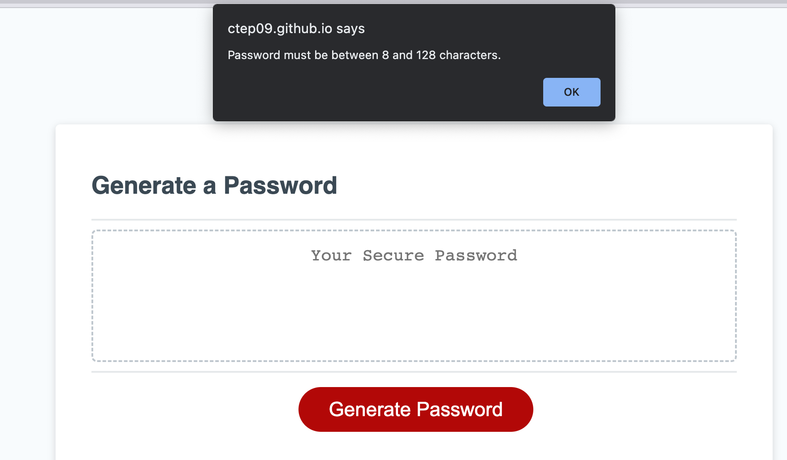

# Password Generator 5000

# Description 

Password Generator 5000 is a one stop shop for creating a unique password to appease any criteria. This tool is easy to use and available as many times as any user caser to utilize it. The trio; HTML, CSS, and JavaScript were used to create this dynamic password generator. As a new developer this project put all of my new skills to the test and helped create new ones.  

[Use Password Generator 5000 Here](https://ctep09.github.io/password-generator-5000/)

## Usage 

Password Generator 5000 is designed to make you a completely random password that from upper and lowecase letters, numbers, and special unicode characters. The interface is user friendly and easy to navigate. 

After clicking the "Generate Password" button, a prompt will appear asking you to select how many characters you would your password to be made of. User must select between 8 and 128 characters, if they attempt to input a number that is ouside of that range, they will get an error alert and back to the main window. 

In order for the user to start the process again, they will need to click the "Generate Password" button. The user must also select at least one character type (uppercase, lowercase, number, special character) or they will once again be presented with an error alert.

## License
MIT License

---
